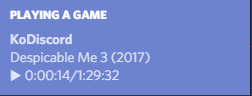
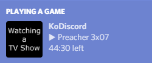

# KoDiscord

This small application sits in your system tray, and watches Kodi's currently played media.
If it happens to notice a `movie` or `episode` to be playing it sets your Discord status to `movie` or `episode`.

You can even have this running in the background, if no media is detected it removes the Discord Rich Presence, and once media detected again, reconnects the Discord Rich Presence.

# Examples:  
### Movie is playing  

### Movie is paused  

### TV Show is playing  

### TV Show is paused  

# Thanks
Kodi icon used: [Papyrus Development Team](https://github.com/PapirusDevelopmentTeam)  
Inspiration: [DCustomRPC](https://github.com/JakeMakesStuff/DCustomRPC)

# Contributions
Are most welcome, feel free to create a Pull Request or create a new issue if you have one.  
I'll try and maintain this repository as long as I can and needed.
